### Initial Example
To generate the plot, run `python -m main --mode init_example`

  
   
  <em>Figure 1: Initial example.</em>

Notes:

* Daily high of the Microsoft stock price between June 1st and December 31st 1989
* Training data  &#9733; (80%), test data &#9679; (20%)
* Green line indicates mean function $\mu$
* Standard deviation $\sigma_{\mu}$ indicated by red dashed lines and shaded grey area
* Radial basis function function with parameters (definition cf. [3.](#references))

|Parameter                    |Value     |
|-----------------------------|----------|
|length-scale                 |10.0 days |
|output-scale                 |5.0 $     |
|$\sigma_{P}$: std of price   |0.01 $    |

**Bottom line:** The parameters have been chosen to achieve a visually compelling result. If it's of any practical use remains to be seen. Implementation seems to work as result look plausible. 

### One-day returns using adjusted closing price
Start with a plot of the timeseries of one-day returns of the adjusted closing prices
* Analyze return instead of price => timeseries is "closer" to stationarity => Use of standard signal processing methods possible
* One-day returns of adjusted closing price is used => Closing price is considered the most important stock price of the day

To generate the plot, run `python -m main --mode plot_return_ts` 

  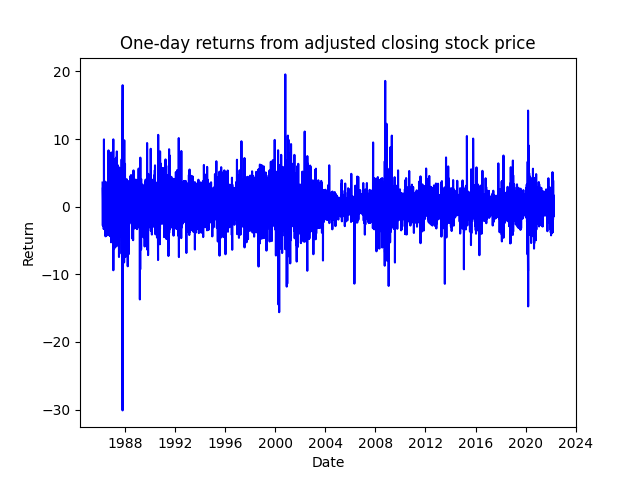
   
  <em>Figure 2: One-day returns based on adjusted closing price.</em>

Notes:

* Unfortunately, the plot suggests very small to no temporal correlation of the returns. As far as my reading goes, this aligns with empirical findings from finance and is to be expected for a somewhat efficient market. 
* If there is no temporal correlation in the timeseries, using a gaussian process (or any other method) is pointless: 
  * The predictive covariance becomes diagonal => Representer-weights are simply the scaled observations. In case of existing temporal correlation, each representer-weight is a linear combination of observations with weights depending on the kernel function and the noise level. 
  * If there is no temporal correlation, the prediction does not even depend on the data and is simply given by the prior 
  * "Prediction" for training data yields a result between prior and original observation depending on the assumed noise level. 

Let's look at the data in more detail:

To generate the plot, run `python -m main --mode plot_return_full`

  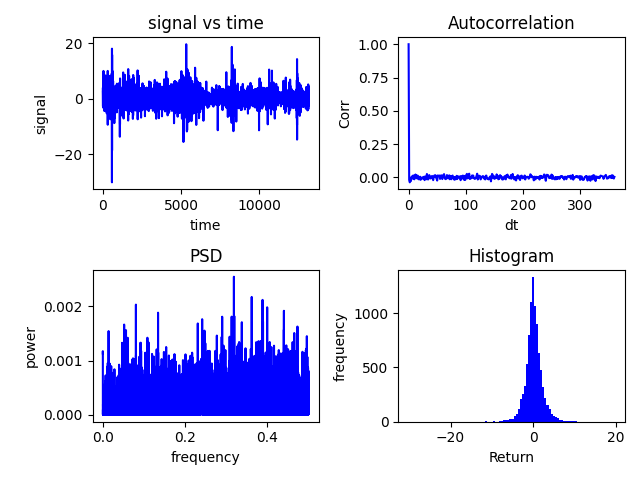
   
  <em>Figure 3: Detailed look at one-day returns based on adjusted closing price.</em>

Notes:

* signal vs time is identical to Figure 2
* Autocorrelation shows the autocorrelation function of the signal using the function acovf from statsmodels.tsa.stattools to handle missing data (no trading at the weekend). 
  * *Note that I switched to a calculation using a Lomb-Scargle periodogram beginning with [Fit GP to absolute returns](#fit-gp-to-absolute-returns), which did not change the results.*
* PSD is the power spectral density estimated using a Lomb-Scargle periodogram taken from astropy.timeseries (again to handle data gaps). The cut-off frequency is set according to the median sampling of the data. 
* Histogram is simply the histogram of the returns.
* We need to be a bit careful with the interpretation as acf- and psd- calculation require stationarity. 
  * While the mean of the data is most likely stationary, the variance appears to vary quite a bit. 
  * There seem to be clusters of higher and clusters of lower variance (=> volatility clustering?). 
  * We'll look at subsets of the data down the line to make sure nothing funny is going on.
* The result suggests that there are no temporal correlations in one-day returns:
  * Autocorrelation drops immediately to zero
  * PSD is flat(ish) => white noise

Just to make sure, a detailed looks at two subsets of the data with constant variance. 

To generate the plot, run `python -m main --mode plot_return_full_subs`

  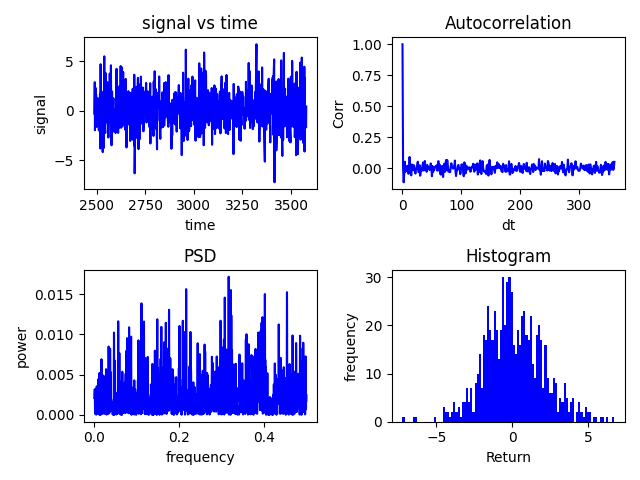 &nbsp;&nbsp;&nbsp;  
    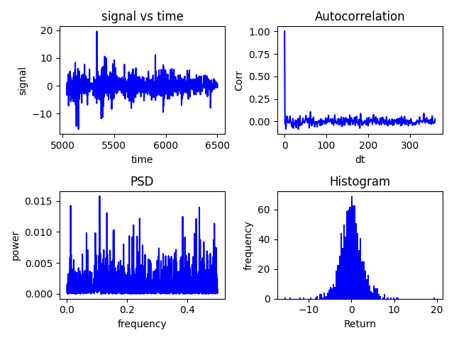
   
  <em>Figure 4: Detailed look at subsets of the data assumed stationary.</em>

Notes:
* Timeframe with low variance 1st January 1993 - 31st December 1995 (left)
* Timeframe with high variance 1st January 2000 - 31st December 2003 (right)
* Pretty much confirms results in Figure 3 => No autocorrelation in the data

**Bottom line:** Predicting one-day returns using GPs will not work due to the lack of temporal correlation. 

### Absolute values of one-day returns
Analyze absolute values of one-day returns:
* Volatility clustering: Large changes often follow large changes and small changes often follow small changes => implies temporal correlation in the data
* Is it possible to predict absolute values of returns? => proxy for volatility => volatility prediction is useful for risk assessment
* Why not squared returns?
  * Data would follow a $\chi^2$-distribution. 
  * For modelling with a GP later down the line, I rather have non-negative gaussian distributed data and deal with or accept the issues from having a non-negativity constraint, compared to $\chi^2$-distributed data.
  *  Not sure if this is the best course of action. According to ChatGPT using non-negative gaussian data leads to less issues in GPs provided that non-negativity is accounted for. $\chi^2$-distributed data violates the assumption inherent to GPs that likelihood function and prior are gaussian. 

To generate the plot, run `python -m main --mode plot_return_ts --return_mode abs` 

  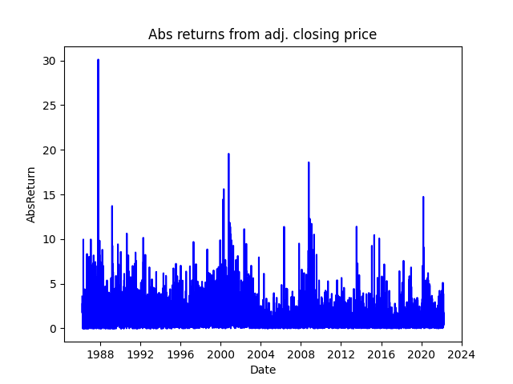
   
  <em>Figure 5: Absolute values of one-day returns based on adjusted closing price.</em>

To generate the plot, run `python -m main --mode plot_return_full --return_mode abs` 

  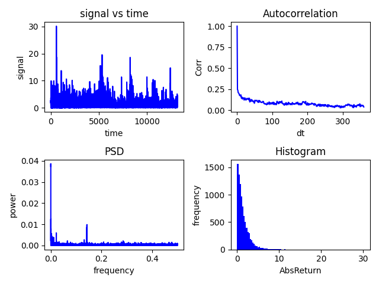
   
  <em>Figure 6: Detailed look at absolute values of one-day returns based on adjusted closing price.</em>

Notes:
* Like Figures 2 and 3 for the absolute values of the returns (adj. closing price)
* Autocorrelation and PSD suggest that there is some slight temporal correlation 
* Same as for Figures 2 and 3 => Variance over complete timeframe not constant => Look at subsets to have data closer to stationarity

To generate the plot, run `python -m main --mode plot_return_full_subs --return_mode abs`

  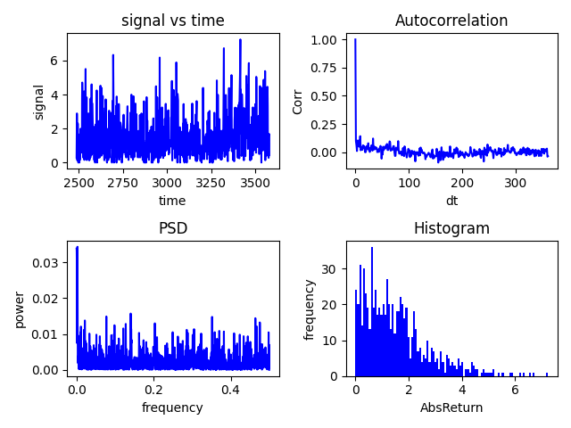 &nbsp;&nbsp;&nbsp;  
    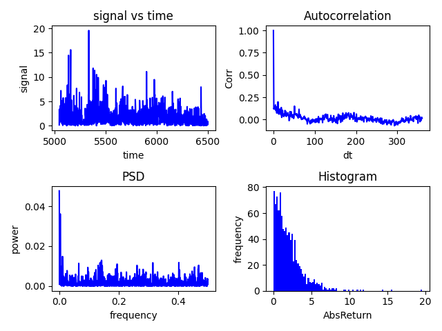
   
  <em>Figure 7: Detailed look at subsets of the data assumed stationary.</em>

Notes:
* Timeframes identical to Figure 4
* Timeframe with low variance 1st January 1993 - 31st December 1995 (left) => TFL
* Timeframe with high variance 1st January 2000 - 31st December 2003 (right) => TFH
* For TFH the temporal correlation is at least as "strong" as for complete timeseries (Figure 6)
* TFL shows hardly any temporal correlation

Look at two more subsets
To generate the plot, run `python -m main --mode plot_return_full_subs --return_mode abs`

  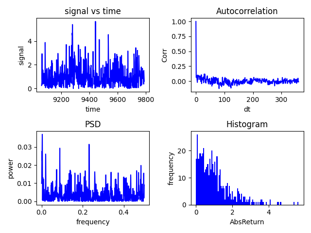 &nbsp;&nbsp;&nbsp;  
    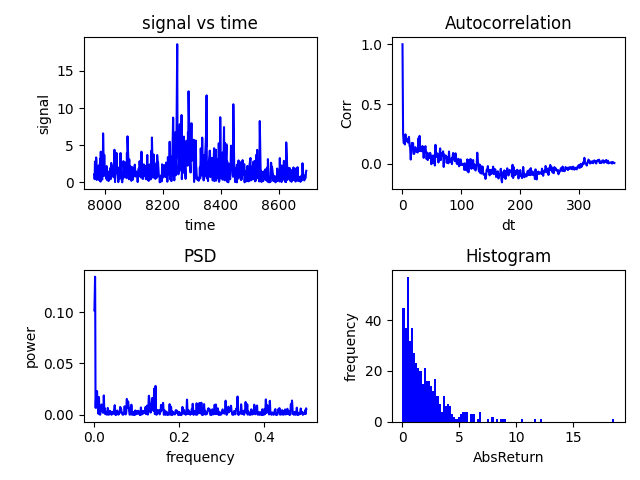
   
  <em>Figure 7: Detailed look at subsets of the data assumed stationary.</em>

Notes:
* Timeframe with low variance 1st January 2011 - 31st December 2012 (left) => TFL2
* Timeframe with high variance 1st January 2008 - 31st December 2009 (right) => TFH2
* TFL2 similar to TFL => Hardly any temporal correlation
* TFH2 shows quite significant temporal correlation compared to all other results

**Bottom line:**
* There seems to some temporal correlation in absolute values of returns
* Degree of temporal correlation varies within the timeseries

### Fit GP to absolute returns
Solve two problems:
1. Returns show no autocorrelation => Use absolute returns, which show at least some temporal correlation.
2. Set hyperparameters of GP (kernel function+parameters, standard deviation of measurement noise)

Solution to problem 2. is to represent the kernel function of the GP meant to fit the absolute returns (GP_M) by a gaussian process (GP_ACF):
* Calculate autocovariance-function (acf) (see: [acf_tool.py](../acf_tools.py)/compute_acf)
* Fit GP with rbf kernel to acf estimate (see: [acf_tool.py](../acf_tools.py)/fit_acf) => GP_ACF
  * Kernel functions need to be positive-semi-definite. There is no guarantee that GP_ACF satisfies that. However, it worked out for the processed examples.
  * Instead of GP_m hyperparameters, GP_ACF-hyperparameters need to be set => GP_ACF parameters are easier to determine! For the experiments in this section, length-scale=45 days, output-scale=1, and $\sigma=0.05$ are used. The important parameter is length-scale, which should not be too small. Otherwise noise may be identified as signal. 
* Estimate standard deviation of measurement noise:
  * Model measurement as signal + noise => $m_i=s_i+n_i$
  * Since signal and noise are independent, the variance of the measurement is given by $\sigma_m^2 = \sigma_s^2 + \sigma_n^2$ 
  * $\sigma_m^2$ - variance of measurements => Estimate from timeseries
  * $\sigma_s^2$ - Use ACF at zero lag as estimate of signal variance => Assume underlying signal acf is somehow smooth
  * $\sigma_n^2 = \sigma_m^2 - \sigma_s^2$ 

ACF and GP_ACF estimates for the four timeframes used above (TFL, TFL2, TFH, TFH2).

To generate the plot, run `python -m main --mode plot_acf_subs --return_mode abs`

  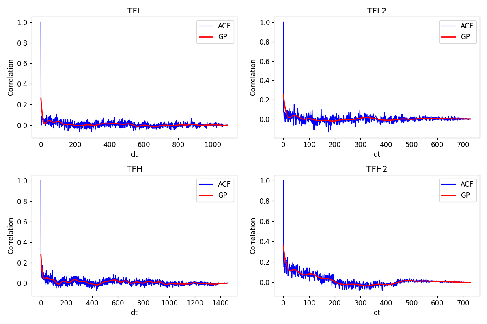 
   
  <em>Figure 8: ACF for subsets together with estimated GP_ACF</em>

Notes:
* Aim was to capture the underlying covariance structure of the signal while smoothing out noise
* Results look plausible

Next step is to fit the GP_M to the data of the four timeframes used above (TFL, TFL2, TFH, TFH2). For clarity, only the plot for TFH2 is presented here. TFL and TFL1 are unsurprisingly not very interesting, as there is hardly any temporal correlation to use. The results for TFH mostly look like those obtained from TFH2. 

To generate the plot, run `python -m main --mode plot_gpr_gpkernel_subs --return_mode abs` 
* In order to switch of any prediction and subsampling of the timeframe, set prediction_horizon to zero and subsample_timeframe to False in [main.py](../main.py)/fit_gpr_gpkernel_subsets=>Calls to fit_gp.

  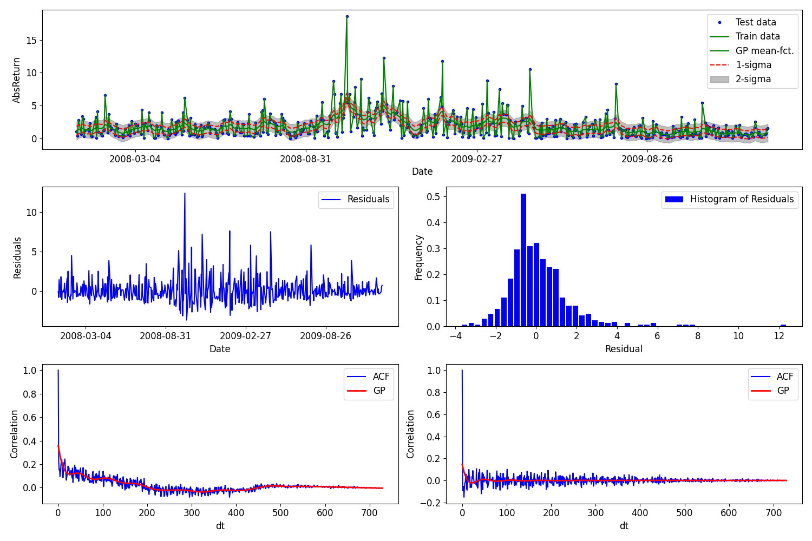 
   
  <em>Figure 9: Analysis of GP_M conditioned to TFH2 without prediction</em>

Notes:
* Use all data points in timeframe to fit GP_M and subsequently estimate GP_M mean and standard deviation for all data points. This is mostly a sanity check to see if the approach does anything useful.
* Top row shows GP_M mean function and standard deviation together with training- and test-data.
* Middle left shows the residuals of all predictions.
* Middle right shows the histogram of the residuals.
* Bottom left and right show ACF and GP_ACF (normalized to autocorrelation for plotting purposes) for the data and the residuals, respectively.
* GP_M mean and covariance look plausible: 
  * Mean function captures the timeframe of increased "volatility" from August 2008 to December 2008 successfully.
  * Mean function does not seem to overfit data.
  * Standard deviation is almost constant. This is expected as the sampling is very close to regular and all measurements are assumed to have equal standard deviation.
  * Estimated standard deviation visually fits the distribution of the data.  
* Distribution of residuals: Probably not gaussian as it has a fat right tail and also seems to be skewed to the right. Original data seemed to be non-negative gaussian distributed => Might be worth investigating.
* ACF/GP_ACF: The ACF of the residuals shows only minimal temporal correlation => GP_M captures the contained signal successfully. This is quite close to the desired result => Estimate the underlying signal, such that the residuals are temporally uncorrelated (i.e. white noise). 

Repeat the test using only 50% of the data in the timeframe for training and predict for all data points within the timeframe.

To generate the plot, run `python -m main --mode plot_gpr_gpkernel_subs --return_mode abs` 
* In order to switch of any prediction and enable subsampling of the timeframe, set prediction_horizon to zero and subsample_timeframe to True in [main.py](../main.py)/fit_gpr_gpkernel_subsets=>Calls to fit_gp.

  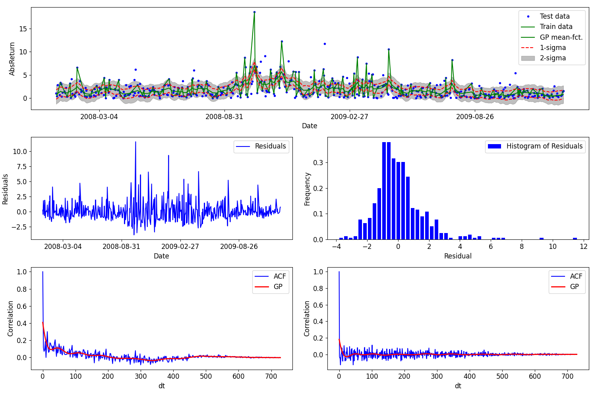 
   
  <em>Figure 10: Analysis of GP_M conditioned to TFH2 without prediction</em>

Notes:
* This test aims to investigate if the GP_M prediction generalizes to "unseen" data in an easy setting. Since there are usually training data closely before and after a test data point, lack of information from the data due to low correlation should not be an issue. 
* For a description of the content of the subplots, see Figure 9. 
* Only marginal differences to Figure 9. 
* Due to the lower data density (only half the training data points compared to Figure 9), the GP_M estimate of the standard deviation is larger.
* The ACF/GP_ACF of the residuals indicates a slightly higher level of residual temporal correlation => Since the difference is very small, it is ignored for now.
* Result shows that GP_M does generalize reasonably to "unseen" test data provided no extrapolation (i.e. prediction of future values) is done. 

In order for the approach to be any useful, it needs to be able to predict the expected absolute return. Repeat the test using all of the training data in the timeframe and predict for the upcoming year. 

To generate the plot, run `python -m main --mode plot_gpr_gpkernel_subs --return_mode abs` 
* In order to predict a year into the future and disable subsampling of the timeframe, set prediction_horizon to 365 and subsample_timeframe to False in [main.py](../main.py)/fit_gpr_gpkernel_subsets=>Calls to fit_gp.

  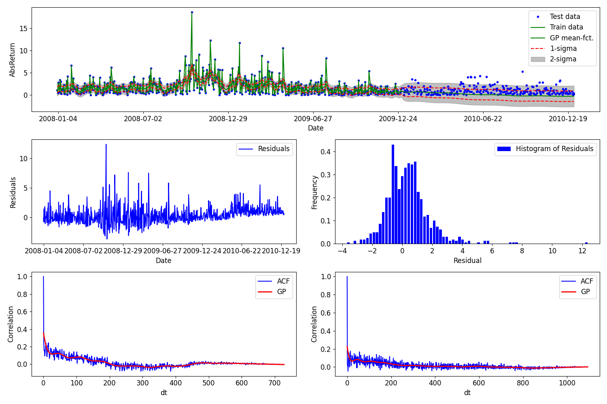 
   
  <em>Figure 11: Analysis of GP_M conditioned to TFH2 with prediction</em>

Notes:
* This test aims at investigating the long term behavior of the prediction. 
* For a description of the content of the subplots, see Figure 9. 
* GP_M does not predict the slight uptrend visible in the expected returns beginning in June 2010.
* GP_M mean and standard deviation approach prior values for large prediction horizons => After 6 months, the estimated values are practically identical to the prior. 
* A comparison with the ACF plots of the residuals in Figure 9 (the difference is, that in Figure 10 also the future prediction influences the result) shows stronger "residual" temporal correlation if future data is considered => The model does not work as good for future points. 
* The main issue with predicting far into the future is that prediction points hardly get any information from the measured timeseries due to the relatively low temporal correlation and thus tend to the prior values.

**Bottom Line:**
* Excluding predictions, GP explains data fairly well (cf. Figures 9 and 10).
* Long term prediction does not work due to relatively low temporal correlation (cf. Figure 11).

**Next:**
* Predict for shorter prediction horizons and evaluate results
* One approach may be to randomly select short subsets (like 100-200 days) and predict a couple of days into the future and evaluate the results with respect to a simple estimator (mean value of selected timeframe or line fit using data immediately before prediction).
