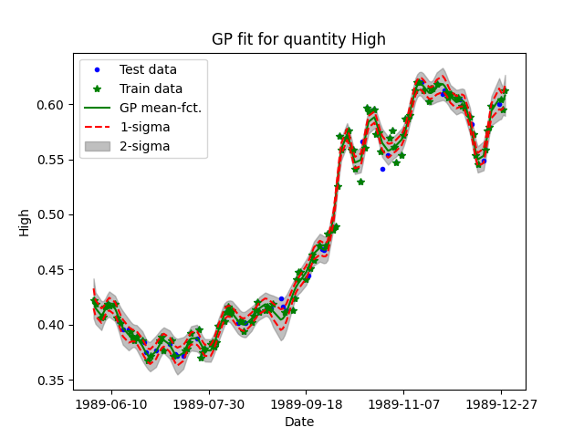
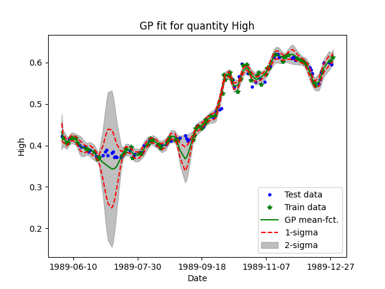

# MSFT vs GP
## Table of Contents

1. [Introduction](#introductionn)
2. [References](#references)

## Introduction

### Motivation

#### Why Gaussian Processes?

My interest in Gaussian Processes (GP) was sparked while I was following along the lecture Probabilistic Machine Learning given by Philipp Hennig (cf. 1. in [References](#references)). The lecture is a beautiful and extensive introduction into the topic featuring both theory and implementation and is complemented by youtube videos. If your aim is to understand GPs in depth, I would highly recommend to check it out. 

The thing that struck me the most about GPs is their flexibility. Using standard parametric approaches to parameter estimation, the first question is usually which parametric model may be appropriate  for the data at hand. Specifying said model can be quite frustrating and tedious. Instead of a full parametric model "only" the kernel function and its hyperparameters must be specified when working with GPs. One may ask now, what the advantage of the GP compared to a parametric model actually is. Ultimetely, we just replaced the choice of a functional model with the choice of a kernel function.  In my opinion there are a couple of distinct advantages:

* The range of functions that can be sampled from a GP (given its kernel function and hyperparameters) is larger than the range of functions that can be sampled from a parametric model. 
* Adapting the model to a specific dataset only requires adaption of the kernel function and its hyperparameters opposed to completely changing the parametrization of the model.
* Automatic tuning of hyperparameters seems more practical compared to parametric regression as usage of gradient based optimization approaches is possible (unless you want to optimize over different kernel functions).

In order to get some hands-on experience with GPs, I decided to implement it myself more or less from scratch. I am aware that there are existing implementations that are much better than my take on the topic (e.g. 2. in [References](#references)). However, the aim is not to implement a competetive python package, but to understand the mechanics of working with GPs. 

#### Why Microsoft stock data?
The reason I picked Microsoft stock data to run my GP implementation on is two-fold. Firstly, the data is one-dimensional (e.g. one independant and one dependant variable) and meaningful chunks of data are limited in size making inference on a relatively weak computer feasible. Secondly, I really wanted to work with financial data. So far I have mostly worked with sensor data resulting from some physical measurement process (e.g. image data or timeseries data resulting from a range-finder etc.). Looking into financial data offers new challenges and is a good chance to broaden my horizon. Furthermore, there are obvious and tangible applications of applying GPs to financial data such as predicting stock prices or returns. 

### Initial Example

  
   
  <em>Figure 1: Initial example.</em>

The above example (Figure 1) shows the highest microsoft stock price (cf. <a href="/DataSets/Docs/Datasets.md">Datasets</a>) for each day between June 1st and December 31st 1989 (&#9679; and &#9733;). Using 80% of these data a Gaussian Process has been trained whose mean function $\mu$ is indicated by the green line.  The data used for training (GP has been conditioned on these data) is referred to as training data and is shown as &#9733;. The complementary dataset, for which only predictions are made, is referred to as test data and indicated by &#9679;-symbols. 
The fit between model and data looks quite promising considering the facts that the formulation of the model is quite simple and the data exhibits a rather complex structure. Apart from the choice of the kernel function and its parameters, only assumptions about the standard deviation of the data are necessary to achieve this fit. 
In  particular, the following parameters have been used to produce the plot shown above. 

|Parameter                    |Value     |
|-----------------------------|----------|
|length-scale                 |10.0 days |
|output-scale                 |5.0 $     |
|$\sigma_{P}$: std of price   |0.01 $    |

The definition of the radial basis kernel function with parameters length_scale and output_scale has been adopted from [3.](#references). Basically, length-scale controls how rigid the resulting mean function is gonna be, while output_scale controls its variability along the taget axis. 
Finally, the assumed standard deviation of the stock price data $\sigma_P$ mainly influences the standard deviation $\sigma_{\mu}$ of the GP mean function $\mu$ displayed in the plot by the dashed red lines (1x$\sigma_{\mu}$) and the shaded gray area (2x$\sigma_{\mu}$), respectively. Additionally, $\sigma_P$ controls how closely the prediction has to interpolate the training data.  

  
   
  <em>Figure 2: Initial example with increased portion of test data.</em>

Problems start to show as soon as the portion of test data is increased. The result for a split with 50% training and 50% test data is shown in Figure 2. It is apparent that the model performs poorly for time periods where there are no training data points. Although the model indicates a high uncertainty about its mean function via the estimated $\sigma_{\mu}$, which is clearly visible in Figure 2, the estimate  

**Fit data and leave large gap in between with parameters==plot**

The green line indicates the mean function $\mu$ of a Gaussian Process (with radial basis function kernel) conditioned on 80% of these data. The standard deviation $\sigma$ of the mean $\mu$ is displayed by the dashed lines.

## References
1. [Probabilistic_ML](https://github.com/philipphennig/Probabilistic_ML)*: "Probabilistic Machine Learning" Course at the University of Tübingen, Summer Term 2023, Philipp Hennig. Under [Creative Commons Attribution-NonCommercial-ShareAlike 4.0 International License.](https://creativecommons.org/licenses/by-nc-sa/4.0/)* Lecture provides a very deep introduction into Gaussian Processes and is complemented by youtube-videos.
2. [GP in scikit-learn](https://scikit-learn.org/stable/modules/gaussian_process.html)*: "Documentation of Gaussian processes in scikit-learn", v1.5.0, [scikit-learn core team](https://scikit-learn.org/dev/about.html#authors), Under [BSD 3-Clause License](https://opensource.org/license/bsd-3-clause)*
3. [GP by Mutual Information](https://www.youtube.com/watch?v=UBDgSHPxVME&t=432s)*: "Gaussian Processes" youtube-video, 23.08.2021, DJ Rich, Under Standard YouTube License.* Video provides a quick and easily accessible introduction into GPs.   

## Possible improvements
* Estimation of data standard deviation from data
* Windowed Fourier-Transform on return-data (stationary for certain periods?) => Estimation of covariance function
* Different kernel-functions 

